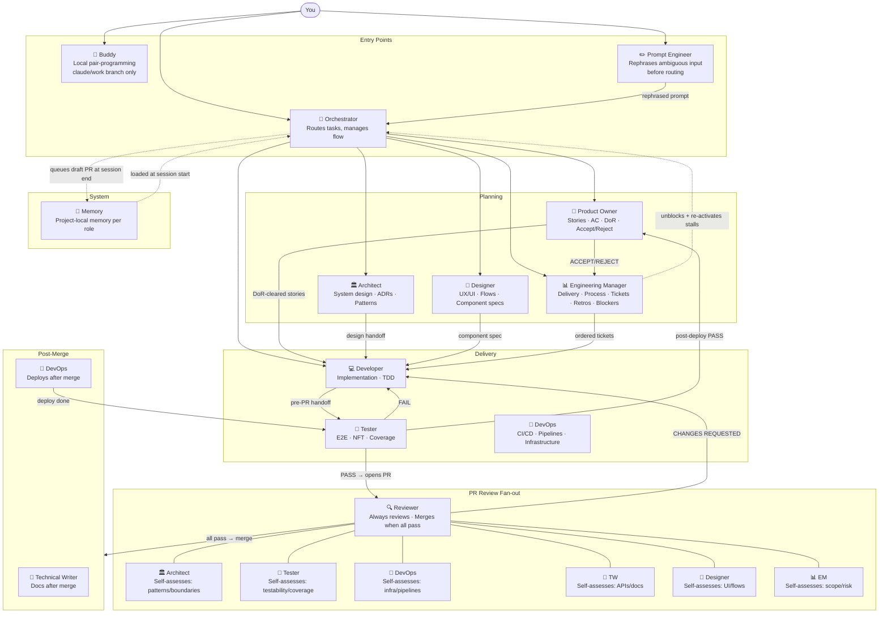
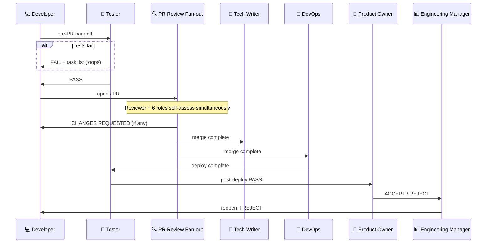
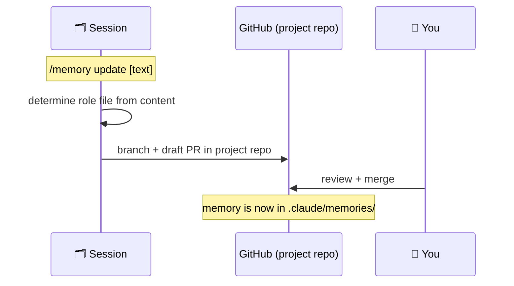

# AI Infrastructure Overview

A collaborative SDLC system built on Claude Code. Instead of one general-purpose AI, it gives you a team of specialised roles — each with its own expertise, model, and memory — orchestrated through a single entry point.

---

## The Big Picture

```
You → /orchestrator → right role for the job → handoff chain → done
```

Every task enters through the **Orchestrator**, which reads your request and routes it to the correct specialist. Roles pass work to each other automatically — the full delivery chain runs without you switching between roles manually. Memory persists across sessions so the system improves over time.

---

## Role Map



---

## Roles at a Glance

| Role | What it does | Trigger |
|---|---|---|
| 🧭 **Orchestrator** | Routes tasks, manages the full delivery chain, learns at session end | `/orchestrator` |
| ✏️ **Prompt Engineer** | Rephrases rough or ambiguous input into a precise, actionable prompt before any role executes — auto-triggered by Orchestrator or invoked directly | `/pe` |
| 🤝 **Buddy** | Local pair-programming on `claude/work` — never pushes, hands back for review | `/buddy` |
| 🎯 **Product Owner** | Story writing, AC, DoR gate, value-based priority ordering, post-deploy accept/reject | `/product-owner` |
| 📊 **Engineering Manager** | Delivery, process, capacity, retros, blockers, ticket lifecycle, re-activates stalled chains | `/engineering-manager` |
| 🏛️ **Architect** | System design, service boundaries, ADRs, PR self-assessment | `/architect` |
| 🎨 **Designer** | UX research, user flows, wireframes, component specs, PR self-assessment | `/designer` |
| 💻 **Developer** | Implementation, TDD, clean architecture | `/developer` |
| 🧪 **Tester** | Pre-PR validation, E2E, post-deploy validation, PR self-assessment | `/tester` |
| 🔍 **Reviewer** | Always reviews every PR; collects all role sign-offs; merges when all pass | `/reviewer` |
| 🚀 **DevOps** | CI/CD, pipelines, deploy, PR self-assessment | `/devops` |
| 📝 **Technical Writer** | Docs after merge, PR self-assessment for API/doc changes | `/technical-writer` |
| 🧠 **Memory** | Project-local memory — stores role rules and corrections in .claude/memories/ | `/memory` |
| 🔐 **Permissions** | Enable/disable Claude Code approval prompts for the current project | `/permissions` |
---

## Default Delivery Chain

The full chain runs automatically — no manual role switching between steps.

```
1. Developer implements → hands off to Tester
2. Tester validates pre-PR → FAIL loops back to Developer
3. Tester PASS → Developer opens PR

4. PR Review Fan-out (all simultaneously):
   ┌─ Reviewer    — always reviews, no exception
   ├─ Architect   — self-assesses: architecture/patterns/boundaries?
   ├─ Tester      — self-assesses: testability/coverage concerns?
   ├─ DevOps      — self-assesses: infra/pipelines/config changes?
   ├─ Tech Writer — self-assesses: API/docs/fragile areas?
   ├─ Designer    — self-assesses: UI/flows/visual behaviour?
   └─ EM          — self-assesses: scope creep/delivery risk?
   Each posts PASS or explicit opt-out. Reviewer collects all.

5. All pass → Reviewer merges PR

6. In parallel:
   ├─ Technical Writer documents
   └─ DevOps deploys

7. Tester validates post-deploy
8. PO validates against story AC → ACCEPT or REJECT
9. EM closes ticket (ACCEPT) / reopens (REJECT → back to step 1)
```

**Product Owner is not part of PR review** — PO validates after deploy, against acceptance criteria.



---

## Buddy — Local Pair-Programming

`/buddy` is a lightweight alternative to the full Orchestrator flow. Use it when you want to work alongside Claude in your editor without going through the full SDLC chain.

**How it works:**
1. Checks your current branch
2. Creates or rebases `claude/work` on top of your branch
3. Makes all changes on `claude/work` — never touches your branch directly, never pushes
4. Commits on `claude/work` and hands back with a summary + copy-pasteable git commands

**Handoff format:**
```
✅ Done — review the changes, then choose how to take them.

What I did:
- [bullet: what changed and why]

── Option A: take as unstaged (recommended) ──
git diff <your-branch> claude/work | git apply

── Option B: merge as a commit ──
git merge claude/work

── After reviewing ──
Keep:     git push origin <your-branch>
Discard:  git checkout -- .   or   git reset --hard HEAD~1
```

**Use Buddy when:** you're a developer, tester, designer — anyone editing files directly and wanting AI help on a safe local branch.

---

## How Memory Works

Every project has its own config in `.claude/`. Memory is project-local — no shared global state, no ongoing remote dependency.

### Project config structure

```
{project}/.claude/
  memories/              ← role memory files (one per role)
    developer-memory.md  ← developer rules for this project
    tester-memory.md
    reviewer-memory.md
    writing-style.md     ← output formatting rules (all roles)
    conduct.md           ← professional judgment rules (all roles)
    ... (one file per role)
  agents/                ← specialist role agents
  commands/              ← skill commands
  corrections.md         ← corrections log (auto-written by roles)
```

All config is copied from the template once at `/memory init`. After that the project owns it.

### Single Responsibility Principle — memory files

Every rule lives in exactly one file. The ownership table in `conduct.md` defines which file owns each category:

| File | Owns |
|---|---|
| `writing-style.md` | Formatting, sentence construction, language choices, output structure |
| `conduct.md` | Professional judgment, behavioural rules, attribution and opener prohibitions |
| `orchestrator-memory.md` | Routing, session-flow, git branching strategy |
| `[role]-memory.md` | Rules specific to that role's domain — not general rules |
| `memory-memory.md` | How memory entries are created and governed |

### Update flow



### Commands

| Command | What it does |
|---|---|
| `/memory init` | Copy full config template into `.claude/` — run once per new project |
| `/memory migrate` | Move an existing `.ai-memory/` project to the new `.claude/` layout |
| `/memory merge` | Pull latest template updates into an already-initialised project — skips files/sections the project doesn't have; project content always wins on conflict |
| `/memory update [text]` | Add a rule to the appropriate role memory file |
| `/memory update` | Scan full conversation, process corrections, store findings |
| `/memory status` | Show all non-empty memory sections |

### Project memory initialisation

**New project** (no prior config):

```
/memory init
```

Copies the full config (memories, agents, commands, corrections.md) from the template into `.claude/` and commits it. Run once per project.

**Existing project on old `.ai-memory/` layout:**

```
/memory migrate
```

Moves memory files from `.ai-memory/` into `.claude/`, fills in any missing universal files from the template, removes `.ai-memory/`.

**Already on `.claude/` — pull template improvements:**

```
/memory merge
```

Merges new entries from the template into existing project files. Never adds files or sections the project doesn't already have.

---

## Permissions

`/permissions` manages Claude Code approval prompts for the current project.

| Command | What it does |
|---|---|
| `/permissions allow all` | Writes a broad allow-all block to `.claude/settings.local.json` — no more approval prompts this session |
| `/permissions reset` | Removes the allow-all block, restoring default prompt behaviour |

`settings.local.json` is gitignored and never committed — changes are local only.

---

## Getting Started

**New machine setup (one command):**

```powershell
irm https://raw.githubusercontent.com/YOUR_USERNAME/ai-memory/master/claude-setup.ps1 | iex
```

This clones the config template to `~/.ai-memory`.

**Per-project setup (inside your project repo):**

```
/memory init
```

Copies all config (agents, commands, memories, corrections.md) into `.claude/` and commits it. Run once per project.

Then open Claude Code in the project and start with `/orchestrator` (for full SDLC flow) or `/buddy` (for hands-on pair-programming).

---

## Key Rules

- **Delivery chain is fully automated.** From Developer handoff to ticket close, every step triggers the next automatically — no manual role switching needed.
- **PR review is a fan-out, not a single gatekeeper.** All 7 technical roles self-assess simultaneously. Reviewer collects all resolutions before merging.
- **Reviewer always reviews every PR** — no opt-out. All other roles self-assess and post explicit PASS or opt-out.
- **Human PR approval is not required** unless you explicitly request it.
- **Buddy never pushes.** `claude/work` stays local. The user decides when to push or revert.
- **DevOps never deploys without a Tester post-deploy PASS** (unless you explicitly override).
- **Memory is role-scoped.** A correction in a Developer session stays in `developer-memory.md` and won't bleed into other roles.
- **Memory never commits directly to master.** Every `/memory update` creates a draft PR on a `memory/session-*` branch. Review and merge before the next update.
- **Memory is project-local.** All memory lives in `.claude/memories/` within the project repo — copied once from the template, owned by the project thereafter.
- **Permissions are local-only.** `/permissions allow all` writes to `.claude/settings.local.json` — gitignored, never committed.

---

## Template Repository Structure

This repo is a template. It is cloned once to `~/.ai-memory/` and then copied into projects via `/memory init`.

```
(template repo)/
├── .claude/
│   └── agents/            ← specialist agent definitions (one per role)
│       ├── developer.md
│       ├── reviewer.md
│       └── ...
├── commands/              ← slash commands (entry points + memory skill)
│   ├── orchestrator.md    ← main entry point
│   ├── memory.md          ← /memory init, /memory migrate, /memory merge, /memory update, /memory status
│   ├── buddy.md
│   ├── pe.md
│   └── ...
├── memories/              ← role memory files (baseline rules)
│   ├── developer-memory.md
│   ├── writing-style.md
│   ├── conduct.md
│   └── ...
├── corrections.md         ← template for project corrections log
├── deployer/              ← MCP server + PowerShell for distributing updates
├── claude-setup.ps1       ← one-command new machine setup
├── setup.sh               ← bash equivalent
├── README.md
└── OVERVIEW.md

```

**What a project gets after `/memory init`:**
```
{project}/.claude/
├── agents/        ← copied from template
├── commands/      ← copied from template
├── memories/      ← copied from template — project edits these
└── corrections.md ← created fresh per project
```
