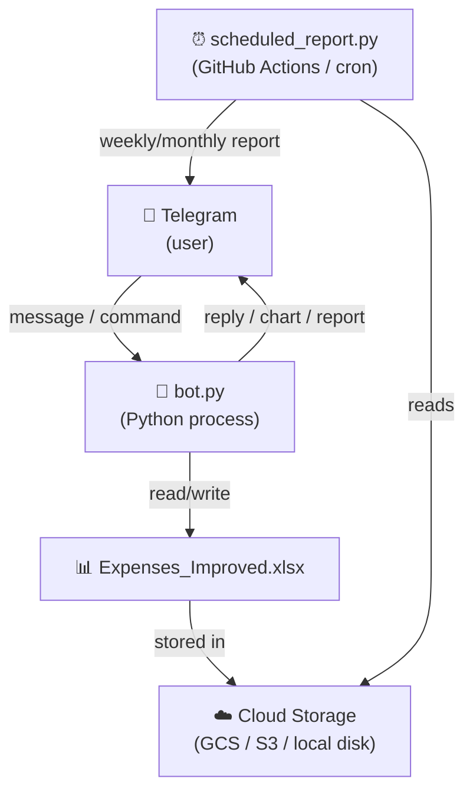
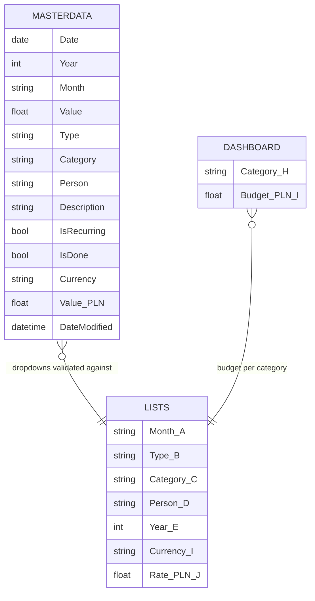
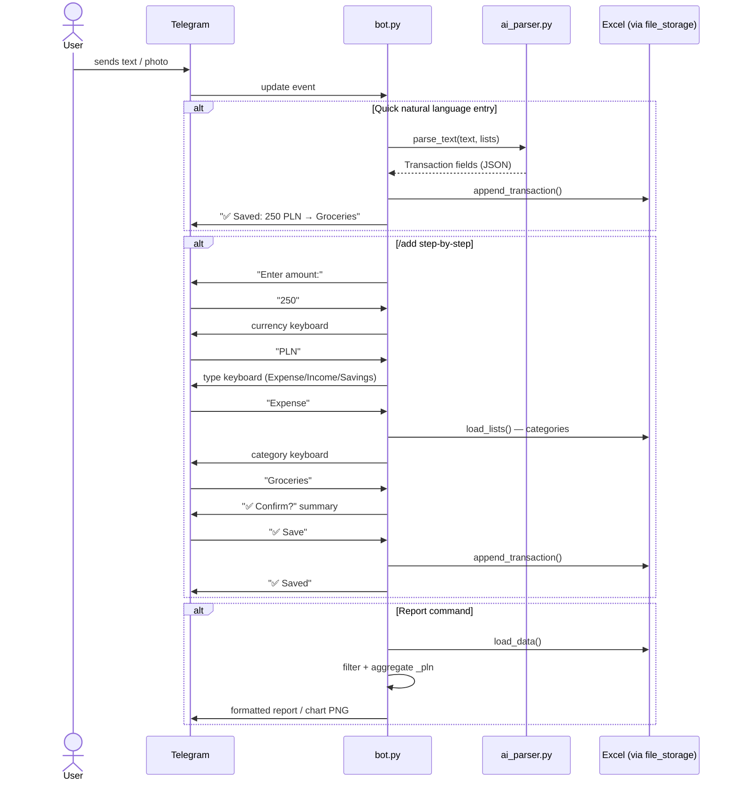
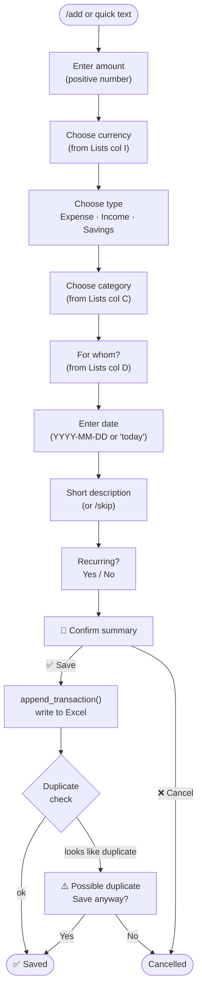
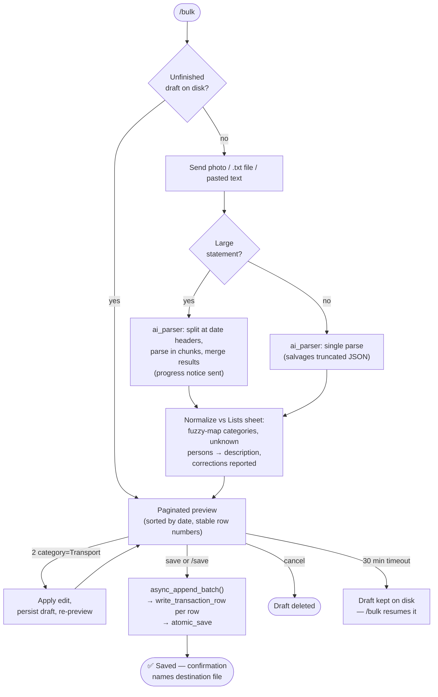
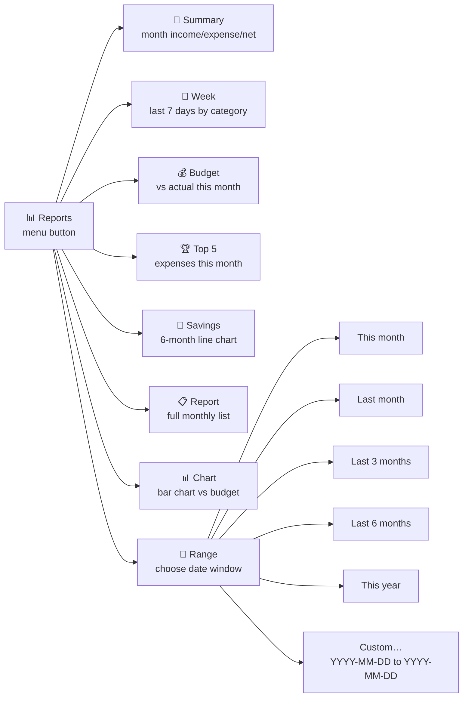
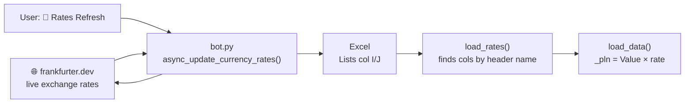
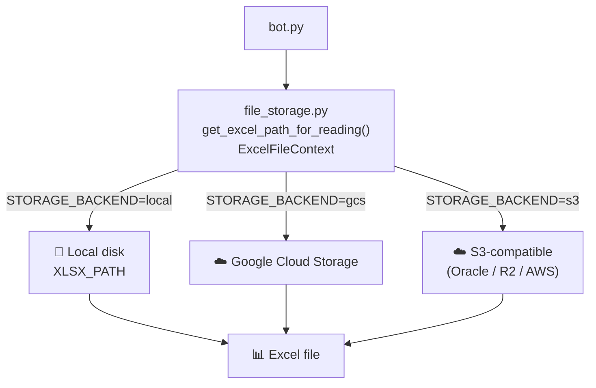
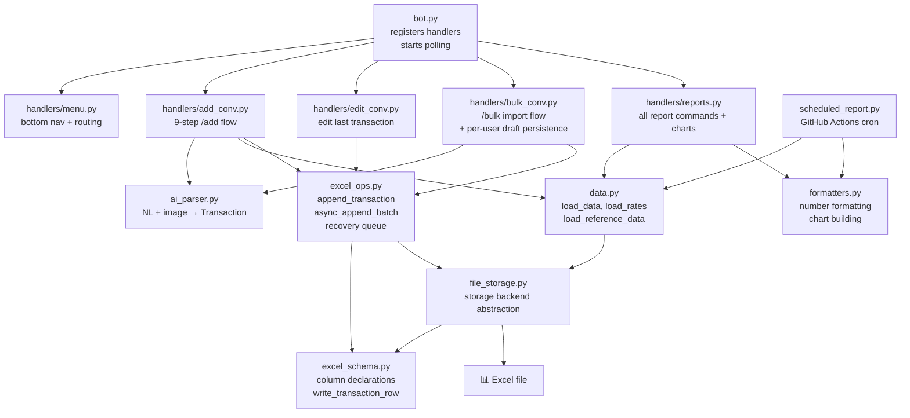

# Architecture & Data Flow

Visual overview of how Budget Bot works — from Telegram message to Excel and back.

---

## System Overview

---

## Excel File Structure

> **Single source of truth:** The **Lists** sheet drives every dropdown in MasterData and every prompt shown by the bot. Add a category to col C — it appears everywhere instantly, no restart needed.

---

## Bot Message Flow

---

## Add Transaction — Step by Step

---

## Bulk Import Flow (/bulk)

Drafts are stored per user as JSON on disk (max 50 pending rows), so they
survive conversation timeouts and bot restarts.

---

## Reports Menu Flow

---

## Currency Rate Pipeline

---

## Storage Backends

---

## Module Map

---

## Scheduled Reports

```mermaid
gantt
    title Automatic reports (UTC)
    dateFormat HH:mm
    axisFormat %H:%M

    section Weekly (every Sunday)
    Weekly budget check : 17:00, 30m

    section Monthly (1st of month)
    Closed month summary : 07:00, 30m

    section Yearly (1st Jan)
    Annual summary : 17:00, 30m
```

---

## Key Design Rules

| Rule | Detail |
|---|---|
| **No hardcoded lists** | Categories, persons, currencies, types all read live from Lists sheet |
| **Single category list** | Lists col C is used for all transaction types (Expense, Income, Savings) |
| **_pln fallback** | If `Value (PLN)` formula cache is empty, recomputed from `Value × rate` |
| **No restart for data changes** | Any Lists sheet edit takes effect on the next bot message |
| **Restart required** | Only `.py` file changes or `.env` changes require a restart |
| **Storage agnostic** | Switch `STORAGE_BACKEND` in `.env` — no code change needed |
| **One column layout** | `excel_schema.py` declares every sheet's columns by header name — no hardcoded positions anywhere |
| **One row writer** | `write_transaction_row` (in `excel_schema.py`) is used by all three write paths: single add, bulk batch, recovery-queue replay |
| **Atomic saves** | Every workbook save goes through `atomic_save`: write to temp file → keep rolling `.bak` → `os.replace` — a crash can't corrupt the data |
| **Bulk drafts persist** | /bulk drafts are per-user JSON files on disk — they survive timeouts and restarts; `save`/`cancel` finalizes |
