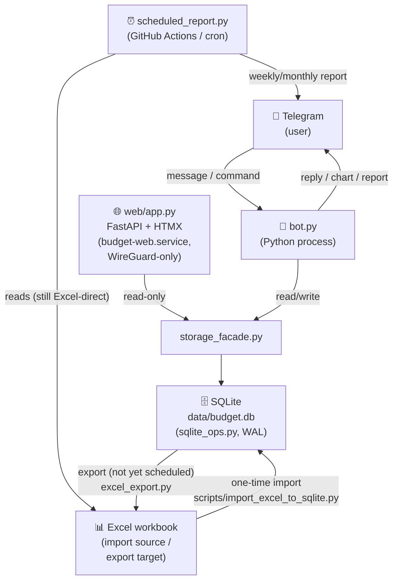
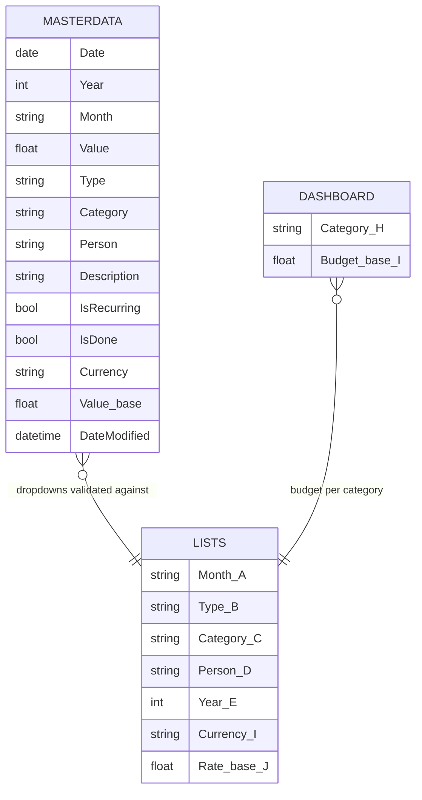
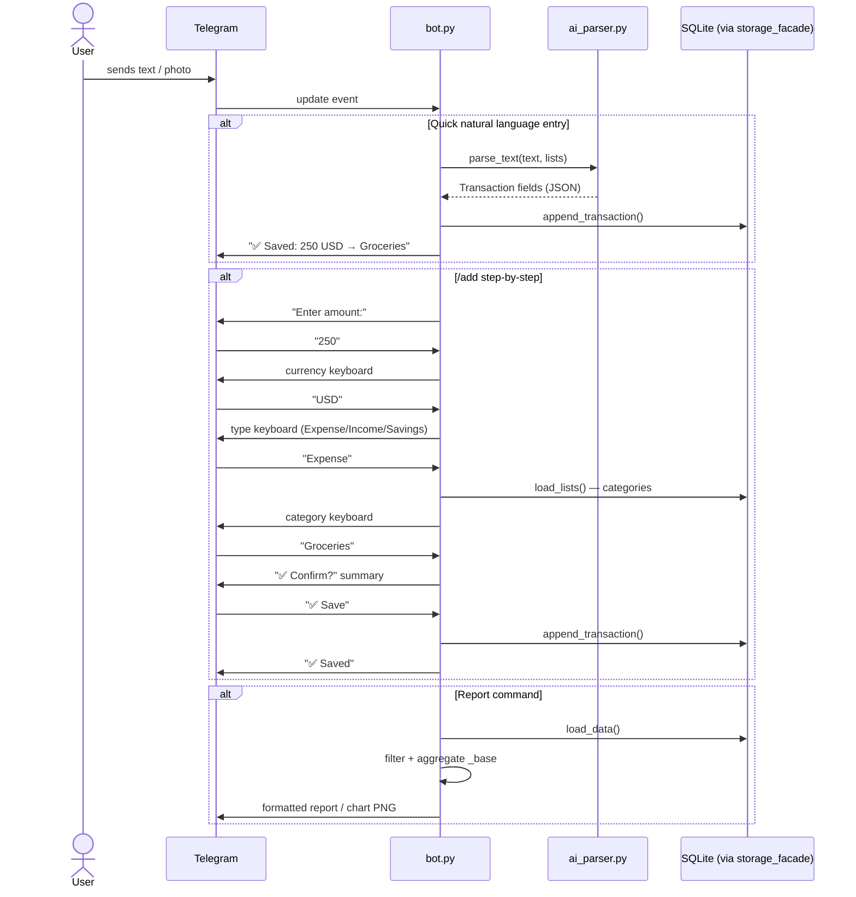
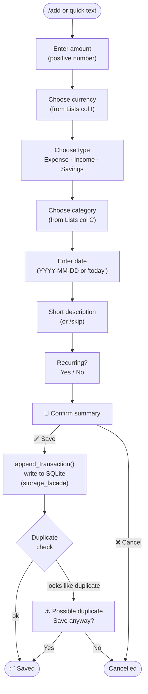
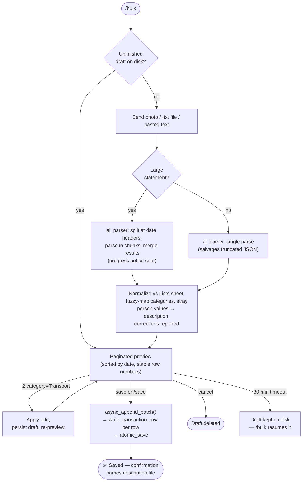
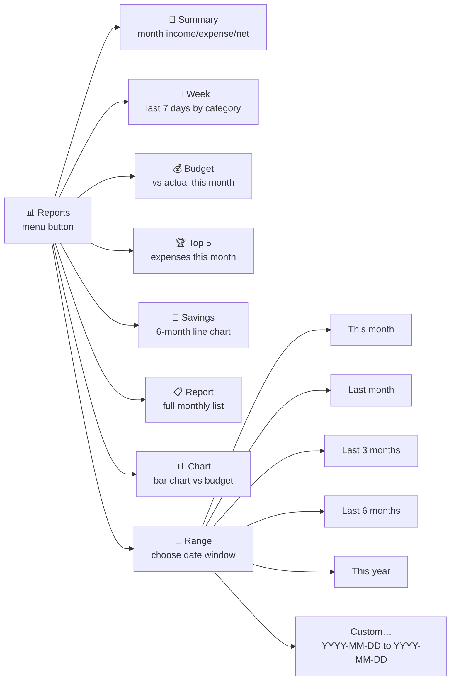
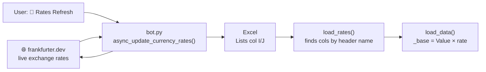
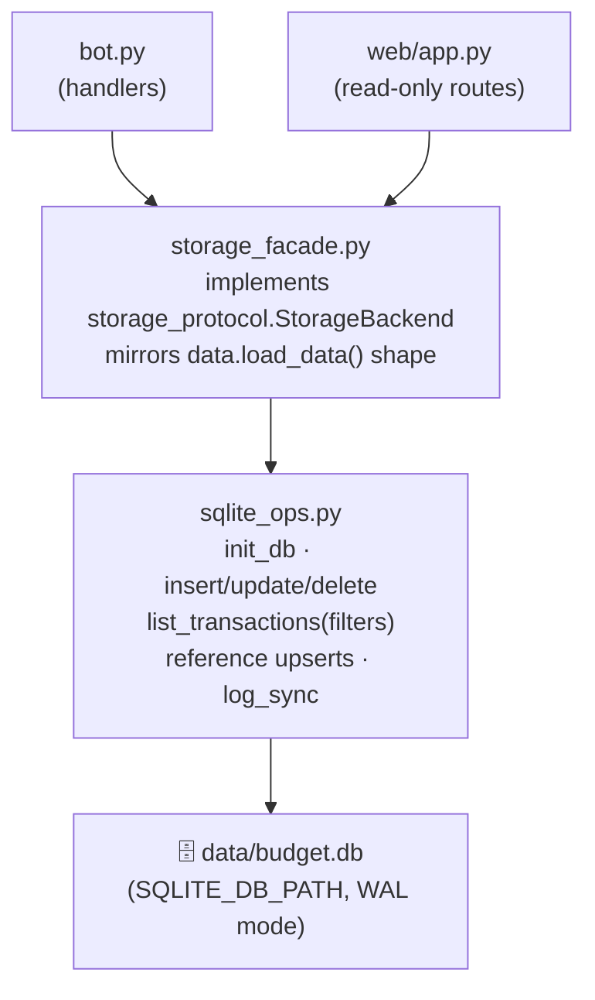
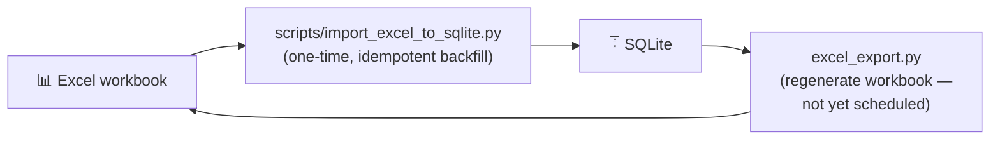
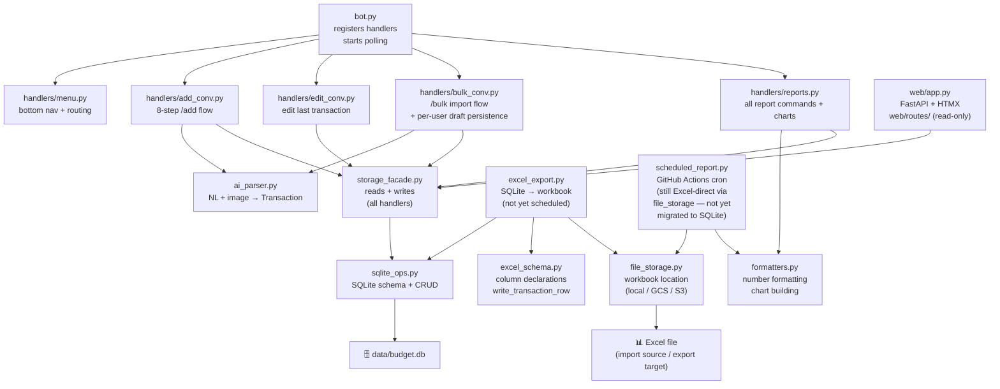

# Architecture & Data Flow

Visual overview of how Budget Bot works — from Telegram message to SQLite and back.

---

## System Overview

```mermaid
graph TD
    TG["📱 Telegram\n(user)"]
    BOT["🤖 bot.py\n(Python process)"]
    WEB["🌐 web/app.py\nFastAPI + HTMX\n(budget-web.service,\nWireGuard-only)"]
    SF["storage_facade.py"]
    DB["🗄️ SQLite\ndata/budget.db\n(sqlite_ops.py, WAL)"]
    SCHED["⏰ scheduled_report.py\n(GitHub Actions / cron)"]
    EXCEL["📊 Excel workbook\n(import source /\nexport target)"]

    TG -- "message / command" --> BOT
    BOT -- "reply / chart / report" --> TG
    BOT -- "read/write" --> SF
    WEB -- "read-only" --> SF
    SF --> DB
    EXCEL -- "one-time import\nscripts/import_excel_to_sqlite.py" --> DB
    DB -- "export (not yet scheduled)\nexcel_export.py" --> EXCEL
    SCHED -- "reads (still Excel-direct)" --> EXCEL
    SCHED -- "weekly/monthly report" --> TG
```

**Storage cutover (S1/S2, 2026-07):** SQLite is the bot's primary store for
transactions and reference lists. Handlers go through `storage_facade.py` →
`sqlite_ops.py` for those reads and writes; the workbook is imported once
via `scripts/import_excel_to_sqlite.py` and can be regenerated via
`excel_export.py` (automatic export scheduling is still pending). Currency
rates, budget targets, and `scheduled_report.py` still read the Excel
workbook — migration pending. The read-only web UI (`web/`) reads the same
database and runs as its own systemd service, `deploy/budget-web.service`,
reachable only over WireGuard (`deploy/setup-wireguard-server.sh` /
`deploy/add-wireguard-peer.sh` set up the VPN); `deploy/auto-update.sh`
restarts it alongside the bot when new code lands.

**Web UI v2 (S2 redesign, PRs #104–#112):** the pages are a full "Ledger"
design — Transactions with date-grouped sticky headers, date-range filter
(Apply button + preset chips), description search, whitelisted sort, and
paginated output (25/50/100 rows per page, default 50); Summary with
period navigation and a stat hero; Cycles with a current-cycle progress
card linking into filtered Transactions. Filtering/sort/pagination live in
the query layer (`sqlite_ops.list_transactions` /
`count_transactions` via `storage_facade.load_transactions`) — the SQLite
schema itself was untouched by the redesign. Display currency and
light/dark theme are per-session preferences carried in the signed session
cookie (`web/currency.py`, `web/theme.py` — `POST /currency`, `POST
/theme`); currency conversion is display-only and nothing is persisted
server-side. Category chips are color-coded deterministically
(`zlib.crc32` hash → 8-hue palette, `web/app.py`), and all colors are CSS
`light-dark()` tokens in `web/static/style.css`.

---

## Excel File Structure

```mermaid
erDiagram
    MASTERDATA {
        date     Date
        int      Year
        string   Month
        float    Value
        string   Type
        string   Category
        string   Person
        string   Description
        bool     IsRecurring
        bool     IsDone
        string   Currency
        float    Value_base
        datetime DateModified
    }

    LISTS {
        string   Month_A
        string   Type_B
        string   Category_C
        string   Person_D
        int      Year_E
        string   Currency_I
        float    Rate_base_J
    }

    DASHBOARD {
        string   Category_H
        float    Budget_base_I
    }

    MASTERDATA }o--|| LISTS : "dropdowns validated against"
    DASHBOARD }o--|| LISTS : "budget per category"
```

> **Single source of truth:** The **Lists** sheet drives every dropdown in MasterData and every prompt shown by the bot. Add a category to col C — it appears everywhere instantly, no restart needed.

---

## Bot Message Flow

```mermaid
sequenceDiagram
    actor User
    participant TG as Telegram
    participant Bot as bot.py
    participant AI as ai_parser.py
    participant Excel as SQLite (via storage_facade)

    User->>TG: sends text / photo
    TG->>Bot: update event

    alt Quick natural language entry
        Bot->>AI: parse_text(text, lists)
        AI-->>Bot: Transaction fields (JSON)
        Bot->>Excel: append_transaction()
        Bot->>TG: "✅ Saved: 250 USD → Groceries"
    end

    alt /add step-by-step
        Bot->>TG: "Enter amount:"
        TG->>Bot: "250"
        Bot->>TG: currency keyboard
        TG->>Bot: "USD"
        Bot->>TG: type keyboard (Expense/Income/Savings)
        TG->>Bot: "Expense"
        Bot->>Excel: load_lists() — categories
        Bot->>TG: category keyboard
        TG->>Bot: "Groceries"
        Bot->>TG: "✅ Confirm?" summary
        TG->>Bot: "✅ Save"
        Bot->>Excel: append_transaction()
        Bot->>TG: "✅ Saved"
    end

    alt Report command
        Bot->>Excel: load_data()
        Bot->>Bot: filter + aggregate _base
        Bot->>TG: formatted report / chart PNG
    end
```

---

## Add Transaction — Step by Step

```mermaid
flowchart TD
    START(["/add or quick text"]) --> VALUE["Enter amount\n(positive number)"]
    VALUE --> CCY["Choose currency\n(from Lists col I)"]
    CCY --> TYPE["Choose type\nExpense · Income · Savings"]
    TYPE --> CAT["Choose category\n(from Lists col C)"]
    CAT --> DATE["Enter date\n(YYYY-MM-DD or 'today')"]
    DATE --> DESC["Short description\n(or /skip)"]
    DESC --> RECUR["Recurring?\nYes / No"]
    RECUR --> CONFIRM["📝 Confirm summary"]
    CONFIRM -->|"✅ Save"| WRITE["append_transaction()\nwrite to SQLite\n(storage_facade)"]
    CONFIRM -->|"❌ Cancel"| END2([Cancelled])
    WRITE --> DUP{"Duplicate\ncheck"}
    DUP -->|"looks like duplicate"| WARN["⚠️ Possible duplicate\nSave anyway?"]
    WARN -->|"Yes"| SAVED(["✅ Saved"])
    WARN -->|"No"| END2
    DUP -->|"ok"| SAVED
```

---

## Bulk Import Flow (/bulk)

```mermaid
flowchart TD
    START(["/bulk"]) --> DRAFT{"Unfinished\ndraft on disk?"}
    DRAFT -->|yes| PREVIEW
    DRAFT -->|no| INPUT["Send photo / .txt file / pasted text"]
    INPUT --> CHUNK{"Large\nstatement?"}
    CHUNK -->|yes| PARTS["ai_parser: split at date headers,\nparse in chunks, merge results\n(progress notice sent)"]
    CHUNK -->|no| ONE["ai_parser: single parse\n(salvages truncated JSON)"]
    PARTS --> NORM
    ONE --> NORM["Normalize vs Lists sheet:\nfuzzy-map categories, stray\nperson values → description,\ncorrections reported"]
    NORM --> PREVIEW["Paginated preview\n(sorted by date, stable row numbers)"]
    PREVIEW -->|"2 category=Transport"| EDIT["Apply edit,\npersist draft, re-preview"]
    EDIT --> PREVIEW
    PREVIEW -->|"save or /save"| WRITE["async_append_batch()\n→ write_transaction_row per row\n→ atomic_save"]
    PREVIEW -->|"cancel"| DISCARD([Draft deleted])
    PREVIEW -->|"30 min timeout"| KEEP["Draft kept on disk\n— /bulk resumes it"]
    WRITE --> DONE(["✅ Saved — confirmation\nnames destination file"])
```

Drafts are stored per user as JSON on disk (max 50 pending rows), so they
survive conversation timeouts and bot restarts.

---

## Reports Menu Flow

```mermaid
flowchart LR
    MENU["📊 Reports\nmenu button"]
    MENU --> SUM["📅 Summary\nmonth income/expense/net"]
    MENU --> WEEK["📆 Week\nlast 7 days by category"]
    MENU --> BUD["💰 Budget\nvs actual this month"]
    MENU --> TOP["🏆 Top 5\nexpenses this month"]
    MENU --> SAV["💾 Savings\n6-month line chart"]
    MENU --> REP["📋 Report\nfull monthly list"]
    MENU --> CHART["📊 Chart\nbar chart vs budget"]
    MENU --> RANGE["📅 Range\nchoose date window"]

    RANGE --> R1["This month"]
    RANGE --> R2["Last month"]
    RANGE --> R3["Last 3 months"]
    RANGE --> R4["Last 6 months"]
    RANGE --> R5["This year"]
    RANGE --> R6["Custom…\nYYYY-MM-DD to YYYY-MM-DD"]
```

---

## Currency Rate Pipeline

```mermaid
flowchart LR
    EXT["🌐 frankfurter.dev\nlive exchange rates"]
    CMD["User: 🔄 Rates Refresh"]
    BOT["bot.py\nasync_update_currency_rates()"]
    EXCEL_LI["Excel\nLists col I/J"]
    LOAD["load_rates()\nfinds cols by header name"]
    COMPUTE["load_data()\n_base = Value × rate"]

    CMD --> BOT
    BOT --> EXT
    EXT --> BOT
    BOT --> EXCEL_LI
    EXCEL_LI --> LOAD
    LOAD --> COMPUTE
```

---

## Storage Layer

The bot and web UI share one storage layer:

```mermaid
flowchart TD
    BOT["bot.py\n(handlers)"]
    WEB["web/app.py\n(read-only routes)"]
    SF["storage_facade.py\nimplements storage_protocol.StorageBackend\nmirrors data.load_data() shape"]
    OPS["sqlite_ops.py\ninit_db · insert/update/delete\nlist_transactions(filters)\nreference upserts · log_sync"]
    DB["🗄️ data/budget.db\n(SQLITE_DB_PATH, WAL mode)"]

    BOT --> SF
    WEB --> SF
    SF --> OPS
    OPS --> DB
```

Transactions no longer flow through the workbook directly — Excel is an
import source and export target (currency rates and budget targets are the
remaining Excel-direct paths):

```mermaid
flowchart LR
    EXCEL["📊 Excel workbook"]
    IMP["scripts/import_excel_to_sqlite.py\n(one-time, idempotent backfill)"]
    DB["🗄️ SQLite"]
    EXP["excel_export.py\n(regenerate workbook —\nnot yet scheduled)"]

    EXCEL --> IMP --> DB --> EXP --> EXCEL
```

`file_storage.py` and the `STORAGE_BACKEND=local|gcs|s3` backends still
handle where the workbook file itself lives (local disk, GCS, S3-compatible)
for import/export purposes.

---

## Module Map

```mermaid
graph TD
    BOT["bot.py\nregisters handlers\nstarts polling"]

    BOT --> MENU_H["handlers/menu.py\nbottom nav + routing"]
    BOT --> ADD_H["handlers/add_conv.py\n8-step /add flow"]
    BOT --> EDIT_H["handlers/edit_conv.py\nedit last transaction"]
    BOT --> BULK_H["handlers/bulk_conv.py\n/bulk import flow\n+ per-user draft persistence"]
    BOT --> REP_H["handlers/reports.py\nall report commands + charts"]

    ADD_H --> AI["ai_parser.py\nNL + image → Transaction"]
    BULK_H --> AI
    REP_H --> FMT["formatters.py\nnumber formatting\nchart building"]

    ADD_H --> SF["storage_facade.py\nreads + writes\n(all handlers)"]
    EDIT_H --> SF
    BULK_H --> SF
    REP_H --> SF

    SF --> OPS["sqlite_ops.py\nSQLite schema + CRUD"]
    OPS --> DB["🗄️ data/budget.db"]

    WEB["web/app.py\nFastAPI + HTMX\nweb/routes/ (read-only)"] --> SF

    EXP["excel_export.py\nSQLite → workbook\n(not yet scheduled)"] --> OPS
    EXP --> SCHEMA["excel_schema.py\ncolumn declarations\nwrite_transaction_row"]
    EXP --> FS["file_storage.py\nworkbook location\n(local / GCS / S3)"]
    FS --> EXCEL["📊 Excel file\n(import source / export target)"]

    SCHED["scheduled_report.py\nGitHub Actions cron\n(still Excel-direct via\nfile_storage — not yet\nmigrated to SQLite)"] --> FS
    SCHED --> FMT
```

---

## Scheduled Reports

```mermaid
gantt
    title Automatic reports (UTC)
    dateFormat HH:mm
    axisFormat %H:%M

    section Weekly (every Sunday)
    Weekly budget check : 17:00, 30m

    section Monthly (1st of month)
    Closed month summary : 07:00, 30m

    section Yearly (1st Jan)
    Annual summary : 17:00, 30m
```

---

## Key Design Rules

| Rule | Detail |
|---|---|
| **SQLite is primary** | Handler transaction reads/writes and reference lists go through `storage_facade.py` → `sqlite_ops.py` (WAL mode); Excel is import source / export target (rates and budget targets are still Excel-read — migration pending) |
| **One facade** | `storage_facade.py` implements `storage_protocol.StorageBackend` and mirrors the `data.load_data()` DataFrame shape, so report code was rewired without behaviour changes (golden-master tests, PR #100) |
| **Web UI is read-only and fail-closed** | `web/app.py` refuses to start unless `WEB_PASSWORD` and `WEB_SESSION_SECRET` are set; bind to a WireGuard IP via `WEB_BIND_HOST`, never `0.0.0.0` |
| **Session cookie carries display prefs** | The signed session cookie holds the login flag plus per-session display currency and light/dark theme (`web/currency.py`, `web/theme.py`); conversion is display-only, nothing persisted server-side |
| **No hardcoded lists** | Categories, currencies, types come from reference tables in SQLite (originally imported from the Lists sheet) |
| **Single category list** | One unified category list for all transaction types (Expense, Income, Savings) |
| **_base fallback** | If `Value (base)` is empty, recomputed from `Value × rate` |
| **Restart required** | Only `.py` file changes or `.env` changes require a restart |
| **Storage agnostic (workbook)** | The exported/imported workbook can live on local disk, GCS, or S3 — switch `STORAGE_BACKEND` in `.env` |
| **One column layout** | `excel_schema.py` declares every sheet's columns by header name — no hardcoded positions anywhere |
| **Atomic workbook saves** | Every workbook save (export path) goes through `atomic_save`: write to temp file → keep rolling `.bak` → `os.replace` |
| **Bulk drafts persist** | /bulk drafts are per-user JSON files on disk — they survive timeouts and restarts; `save`/`cancel` finalizes |
| **Idempotent import** | `scripts/import_excel_to_sqlite.py` dedups by content hash — safe to re-run |
